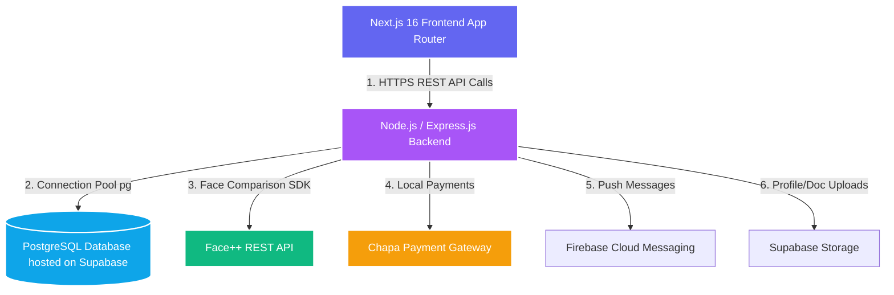

# QuickServe (FYP-WEB) - Comprehensive Project Defense & Study Guide

Welcome! This study guide is designed to prepare you completely for your **Final Year Project (FYP) Defense**. It details every aspect of the **QuickServe** system. Even if you feel like you do not know anything about it right now, reading this guide will give you the confidence and deep knowledge needed to present like a senior software architect.

---

## 📅 Table of Contents
1. **Executive Project Summary** (What is QuickServe?)
2. **System Architecture & Tech Stack**
3. **Standout Technical Highlights (The "Wow" Features)**
4. **Database Schema & Entity Relations**
5. **Functional Workflows (Step-by-Step)**
6. **Codebase Directory Map**
7. **Slide-by-Slide Presentation Blueprint**
8. **Q&A Bank: Handling Tough Jury/Examiner Questions**

---

## 1. 🌟 Executive Project Summary

### The Problem
In developing countries (specifically focused on **Ethiopia**, such as Bahir Dar/Addis Ababa), finding trusted, verified, and skilled local service providers (like plumbers, cleaners, electricians, and personal care experts) is highly fragmented. 
- Customers face **untrustworthy providers**, **lack of transparent pricing**, and **no identity verification**.
- Professional providers struggle to find clients, build a digital portfolio, and monetize their skills.
- Existing marketplaces lack **automated local payments** (like Chapa) and **automated identity verification** to filter scammers.

### The Solution: QuickServe
**QuickServe** is a premium, secure, and bilingual (English/Amharic) digital service marketplace connecting customers with verified local professionals. It streamlines service discovery, booking, real-time tracking, in-app chat, and provider subscriptions.

---

## 2. 🏗 System Architecture & Tech Stack

Here is your custom, high-resolution system architecture diagram. You can copy this visual diagram directly into your PowerPoint presentation:


QuickServe is built on a **decoupled Client-Server (REST API)** architecture. This ensures a clean separation of concerns, security, and scalability.



### Tech Stack Breakdown
*   **Frontend (The Client):**
    *   **Next.js 16 (App Router):** High-performance React framework. Leverages folder-based routing, server configurations, and fast component loads.
    *   **Tailwind CSS (v4.0):** Bleeding-edge responsive utility classes for stunning UI styling.
    *   **React Three Fiber / Three.js:** Renders a floating 3D glassmorphic blob scene in the background for a modern, premium look.
    *   **Framer Motion:** Smooth micro-animations (fade-ins, slide-overs) to enhance user experience.
    *   **Chart.js & React-Chartjs-2:** Renders administrative data visualization (total signups, earnings, booking success rates).
    *   **Bilingual Translation Context (i18n):** Handles dynamic translation switching between **English (EN)** and **Amharic (AM)** without reloads.
*   **Backend (The Server API):**
    *   **Node.js & Express.js:** Fast, asynchronous REST API runtime.
    *   **`pg` (PostgreSQL Client with Connection Pooling):** Connects the API to the cloud database securely with high throughput.
    *   **JWT (JSON Web Tokens) & `bcrypt`:** Secures backend endpoints and hashes user passwords (10 salt rounds) before storing.
    *   **Multer:** Standard middleware for parsing multipart/form-data used for file and image uploads.
    *   **Nodemailer:** Handles automated SMTP mail delivery of 6-digit OTP verification codes.
*   **Cloud Ecosystem & Third-Party APIs:**
    *   **PostgreSQL (Hosted on Supabase):** A highly relational database handling transactional records.
    *   **Supabase Storage:** Hosts public assets such as profile pictures, provider National IDs, selfie checks, and educational documents.
    *   **Face++ Compare API:** Powering automated AI-based identity verification.
    *   **Chapa API:** Ethiopian premier payment gateway handling subscription payments in **ETB**.
    *   **Firebase Cloud Messaging (FCM):** Manages real-time background push notifications.

---

## 3. 💎 Standout Technical Highlights (The "Wow" Features)

When presenting, examiners look for features that prove you did **advanced work** beyond simple CRUD (Create, Read, Update, Delete). Highlight these **four pillars**:

### Pillar 1: AI-Powered Face Identity Verification (Anti-Fraud)
*   **How it works:** During provider signup, the user must upload:
    1.  A Profile Image
    2.  A National ID card (Front & Back)
    3.  A live verification selfie (captured from their webcam).
*   **The Logic:** The backend calls the **Face++ API Compare endpoint**. It compares the selfie against the National ID card faces.
*   **Automated Decision Tree:**
    *   If confidence score is **>= 75%** (matched), the provider is **auto-approved** and can immediately log in.
    *   If confidence score is **< 75%** (not matched), or an error occurs (no face found), the account status stays **pending** for admin review.
    *   If an explicit mismatch is returned, login is blocked.

### Pillar 2: Local Payment Integration (Chapa Gateway)
*   **Why it's crucial:** Solves the localization problem in Ethiopia. Providers must pay a monthly subscription fee of **200 ETB** to stay visible on the marketplace and receive customer requests.
*   **The Flow:** Express initializes a transaction via the Chapa API, returning a checkout URL. The provider completes payment, Chapa redirects to the backend callback, which securely updates `subscription_status` to `'active'` and pushes subscription expiry out by **30 days**.

### Pillar 3: Dynamic Bilingual i18n (English & Amharic)
*   **How it works:** Developed a dynamic translation state using a **React Context Provider (`LanguageProvider`)**. All site vocabulary (dashboard texts, booking statuses, forms) is mapped in locale JSON catalogs (`en.js`, `am.js`). Allows local Ethiopian users to navigate comfortably.

### Pillar 4: Interactive 3D Aesthetics & Analytics
*   **Aesthetics:** The landing page features responsive 3D translucent spheres moving dynamically using **React Three Fiber**, avoiding boring static layouts.
*   **Analytics:** Admins use a dedicated dashboard rendering charts of business performance, category booking density, and total users, proving analytical depth.

---

## 4. 🗄 Database Schema & Entity Relations

QuickServe uses a PostgreSQL relational database. Here is the data blueprint representing how tables are linked together:

```
+------------------+          +-------------------------+          +-------------------------+
|      USERS       | 1      1 |    PROVIDER_PROFILES    | 1      * |        SERVICES         |
|------------------|----------|-------------------------|----------|-------------------------|
| id (PK)          |          | id (PK)                 |          | id (PK)                 |
| name             |          | user_id (FK)            |          | provider_id (FK)        |
| email            |          | bio                     |          | category_id (FK)        |
| password         |          | subscription_status     |          | title                   |
| role             |          | subscription_expiry     |          | description             |
| status           |          | average_rating          |          | price (ETB)             |
| profile_img_url  |          +-------------------------+          +-------------------------+
| nat_id_url       |                        |                                   | 1
| selfie_url       |                        | 1                                 |
| ai_verif_status  |                        |                                   |
| otp, otp_expires |                        | *                                 | *
+------------------+                        |                      +-------------------------+
       | 1                                  |                      |        BOOKINGS         |
       |                                    |                      |-------------------------|
       | *                                  |                      | id (PK)                 |
+------------------+                        |                      | customer_id (FK) -------+ (ref users)
|  NOTIFICATIONS   |                        |                      | service_id (FK)         |
|------------------|                        |                      | provider_id (FK) -------+ (ref users)
| id (PK)          |                        |                      | booking_date            |
| user_id (FK)     |                        |                      | total_price             |
| title, message   |                        |                      | status                  |
| is_read          |                        |                      +-------------------------+
+------------------+                        |                                   | 1
                                            | 1                                 |
                                            |                                   |
                                            | *                                 | *
                                  +-------------------+            +-------------------------+
                                  |     PAYMENTS      |            |        MESSAGES         |
                                  |-------------------|            |-------------------------|
                                  | id (PK)           |            | id (PK/UUID)            |
                                  | provider_id (FK)  |            | booking_id (FK)         |
                                  | tx_ref            |            | sender_id (FK)          |
                                  | amount            |            | receiver_id (FK)        |
                                  | status            |            | message                 |
                                  | payment_method    |            +-------------------------+
                                  +-------------------+
```

### Table Specifications:
1.  **`users`:** Holds customer, provider, and admin profiles, credentials, OTP codes, and uploaded ID files for AI face check results.
2.  **`provider_profiles`:** Links to `users` on a 1-to-1 basis. Tracks subscription state, document uploads, and professional reviews.
3.  **`services`:** Created by providers. Contains details such as category classification, base service price, and description.
4.  **`bookings`:** Stores transaction details when a customer hires a provider. Linked to customer user ID, provider user ID, and service ID.
5.  **`payments`:** Tracks payment receipts from the Chapa gateway (such as transaction references, amount, and payment methods).
6.  **`messages`:** Facilitates in-app messaging context. Holds sender, receiver, text contents, and links directly to the booking ID.

---

## 5. 🔄 Core Functional Workflows (Under the Hood)

Be prepared to explain how data traverses the system for key features:

### Flow A: Provider Registration & Identity Matching
1.  **Client:** The provider fills out the registration form, attaches ID photos and educational documents, initiates their webcam, captures a live selfie, and clicks submit.
2.  **Upload:** Express utilizes **Multer** to parse file buffers and uploads them directly to three separated **Supabase Storage buckets** (`profile-images`, `national-ids`, `selfies`), returning public URLs.
3.  **AI Check:** The backend passes the National ID URL and Selfie URL to the **Face++ API**.
    *   *Result Match:* If Face++ returns a matching confidence score of **>= 75%**, the user account status in the DB is set to `'approved'`.
    *   *Result Dispute:* If confidence is **< 75%**, status is set to `'pending'`.
4.  **OTP:** The backend generates a secure 6-digit verification code, stores it with a 10-minute expiry, and prints the OTP to the console while calling **Nodemailer** to email it.
5.  **Notification:** Database listeners trigger inside the Admin board, indicating that a new provider registration requires manual verification (if pending) or logging.

### Flow B: Service Booking & Lifecycle
1.  **Customer:** Searches service catalog, discovers a provider, views scheduling slot calendars, and clicks "Book Service".
2.  **Booking Creation:** The client triggers `POST /api/bookings` with customer ID, service ID, and desired date.
3.  **Database Insert:** Express processes pricing models, generates a booking record marked `'pending'`, and logs it.
4.  **Instant Notifications:** The backend triggers an in-app notification to the provider profile (`providerController` alerts are pushed).
5.  **Transitions:**
    *   Provider accepts: Status shifts to `'accepted'` (Scheduled).
    *   Job done: Provider marks `'completed'`. Once customer confirms, total price transitions and feedback gates unlock.
    *   Disputes: Users can immediately file a ticket inside `complaints` which lands directly in the admin dashboard for review.

### Flow C: Provider Subscription & Pay Verification
1.  **Provider:** Enters dashboard. If subscription is expired or inactive, they see a warning block asking them to subscribe for 200 ETB.
2.  **Init:** Provider clicks "Subscribe". Frontend triggers `POST /api/payments/initialize-payment`.
3.  **Chapa API Handshake:** The backend calls Chapa's `/transaction/initialize` endpoint with the provider's details, generating a unique transaction ID (`tx_ref` formatted as `quickserve-{timestamp}-{userId}`). Chapa returns a secure payment link.
4.  **Redirect:** The provider pays on Chapa's page via mobile banking (e.g., Telebirr, CBE Birr) and is redirected back to the frontend.
5.  **Callback Verification:** Chapa hits the backend endpoint `GET /api/payments/verify-payment/:tx_ref`.
    *   Express verifies the payment directly with Chapa.
    *   On payment success, it updates `provider_profiles.subscription_status = 'active'` and extends `subscription_expiry` by 30 days.
    *   Generates confirm notifications for the provider and notifies the system admin.

---

## 6. 📂 Codebase Directory Map

If examiners ask you to open specific files or show code, refer to this map:

### Backend Structure (`/Backend/src`)
*   **`server.js`:** The main entry point. Sets up Express, initializes CORS headers, maps all `/api/*` endpoints to router maps, and runs the listener.
*   **`db.js`:** Pool client initialization. Keeps database connections active and exports queries.
*   **`/routes/`:** Maps URL paths to controller actions:
    *   `authRoutes.js` ➔ Login, signup, reset OTP, reset password.
    *   `paymentRoutes.js` ➔ Initialize payment, verify payment.
    *   `adminRoutes.js` ➔ Stats, resolve complaints, approve pending providers.
*   **`/controllers/`:** The core backend business logic:
    *   `authController.js` ➔ Password hashing, JWT token creation, Face++ response analysis.
    *   `paymentController.js` ➔ API calls to Chapa, DB transactions to activate provider profiles.
*   **`/utils/`:** Helper files:
    *   `faceVerification.js` ➔ Communication logic with Face++ API and face thresholds.
    *   `emailService.js` ➔ Nodemailer configuration details.
    *   `supabaseHelper.js` ➔ Helper to upload file buffers to Supabase storage.

### Frontend Structure (`/frontend`)
*   **`/app/`:** Folder-based routing pages:
    *   `layout.js` ➔ Top level global provider wrapper (Language, Auth, Toasts, 3D Background Canvas).
    *   `(public)/` ➔ Accessible by guest users (Landing page, Service browsing, login, register).
    *   `(dashboard)/` ➔ Protected routes requiring login verification:
        *   `/admin` ➔ Visual graphs, user deletion, manual verification lists.
        *   `/customer` ➔ Booking tracker, history reviews, platforms rate form.
        *   `/provider` ➔ Subscriptions portal, service manager, active bookings.
*   **`/src/components/`:** Interactive visual components:
    *   `ThreeBackground.js` ➔ Floating glass blobs scene in Canvas.
    *   `Navbar.js` & `Sidebar.js` ➔ Dynamic dashboard side panels and menus.
    *   `DashboardCharts.js` ➔ Renders statistics charts.
*   **`/src/locales/`:** Language dictionaries containing all key-value mappings:
    *   `en.js` (English strings) & `am.js` (Amharic strings).

---

## 7. 📊 Slide-by-Slide PowerPoint Outline

Use this blueprint to build a highly engaging 10-slide presentation:

*   **Slide 1: Title Slide**
    *   *Title:* QuickServe: A Premium Secure Service Booking Marketplace
    *   *Subtext:* Final Year Project Presentation
    *   *Your Name & ID details*
*   **Slide 2: Background & Problem Statement**
    *   *Points:* Fragile trust in local service bookings; Lack of digital portfolios for providers; High friction in payments; Identity scams.
*   **Slide 3: Project Objectives & Scope**
    *   *Points:* Build a secure 3-way platform (Admin, Customer, Provider); Introduce AI identity checks; Automate local Birr payment processing; Provide seamless bilingual usage.
*   **Slide 4: Technical Stack & Architecture**
    *   *Content:* Include the decoupled Next.js & Express REST API architecture diagram (from Section 2). Mention Postgres/Supabase and Chapa.
*   **Slide 5: Killer Feature 1: AI-Powered Verification**
    *   *Points:* Face++ comparison API. Combats identity theft by matching National IDs against live webcam selfies during registration. Automatic matching vs. manual review queue.
*   **Slide 6: Killer Feature 2: Chapa Payment Integration**
    *   *Points:* Localized monetization. Providers pay a 200 ETB monthly subscription fee. Secure callback verification checks and automatic profile activation.
*   **Slide 7: UI Aesthetics & Dynamic i18n**
    *   *Points:* Glassmorphic frontend with React Three Fiber backgrounds; dynamic English/Amharic localization via React Context.
*   **Slide 8: Database & ER Diagram**
    *   *Content:* Display the Entity-Relationship Diagram showing relational links between users, profiles, bookings, services, and payments.
*   **Slide 9: Project Demonstrations (Screenshots/Live Demo)**
    *   *Content:* Show screenshots of the Landing Page, the Provider subscription gateway, and the Admin manual verification panel.
*   **Slide 10: Conclusion & Future Scope**
    *   *Points:* Successfully built a secure digital ecosystem. Future scope includes GPS map integration for service discovery, CBE Birr/Telebirr USSD automation, and service booking escrow.

---

## 8. 🛡 Q&A Prep: Defeating Tough Examiner Questions

Jury members often ask questions to test if you wrote the code or if you understand key architectural decisions. Study these answers:

### Q1: "Why did you choose a client-server (decoupled) architecture instead of a monolithic setup?"
> **Perfect Answer:** "By separating the Next.js frontend from the Express.js backend, we ensure a clean **separation of concerns**. The frontend handles user interactions and rich aesthetics, while the backend serves as a secure REST API processing business rules. This decoupled architecture allows us to scale or update the client independently, and even build mobile applications in the future that consume the exact same API endpoints without rewrite."

### Q2: "How is your user authentication secured?"
> **Perfect Answer:** "We secure our endpoints using **JSON Web Tokens (JWT)**. When a user logs in, the backend signs a payload with their ID and role using a secret key stored securely in our environment files (`.env`). The client stores this token and passes it in the `Authorization: Bearer <token>` HTTP header for all future requests. Additionally, all passwords are encrypted on the backend using the **bcrypt** hashing algorithm with a salt factor of 10, protecting credentials from database exposures."

### Q3: "What happens if the Face++ AI face comparison fails? Is the user completely locked out?"
> **Perfect Answer:** "No, we designed an intelligent **fail-safe manual fallback**. If the Face++ API score falls below 75% or fails due to network/image clarity, the backend sets the user's status to `pending` instead of rejecting them. The admin is immediately notified, and can manually review the uploaded National ID, selfie, and professional documents via the admin verification dashboard, ensuring a balance between automated efficiency and human oversight."

### Q4: "How do you handle security for Chapa payments? What prevents a user from faking a payment?"
> **Perfect Answer:** "We never rely on the frontend to confirm payment. All payment confirmations are verified **server-to-server**. 
> 1. We generate a secure unique reference key on the backend (`tx_ref`).
> 2. Once the user pays, Chapa triggers a secure HTTP GET callback request directly to our backend server API.
> 3. Our backend makes a direct, authenticated API call to Chapa's official verification server (`api.chapa.co/v1/transaction/verify/:tx_ref`) using our secret key.
> Only when Chapa's server returns a verified success payload do we commit the database transaction to activate the provider's subscription."

### Q5: "What is Database Connection Pooling, and why did you use `Pool` instead of `Client` in Express?"
> **Perfect Answer:** "Opening a new TCP connection for every single database query is extremely slow and resource-heavy. By using `Pool` from the `pg` library, the backend maintains a reusable set of active database connections. When a request comes in, Express borrows a connection from the pool, executes the query, and returns it immediately. This connection reuse significantly reduces latency and allows the backend to handle hundreds of concurrent requests efficiently."

### Q6: "Why did you choose Next.js App Router for the frontend?"
> **Perfect Answer:** "Next.js App Router gives us robust folder-based routing, layout inheritance, and optimized performance. It allows us to group role-based dashboards (`/admin`, `/customer`, `/provider`) cleanly under route groups, securing them using layout wrappers and authentication hooks. It also simplifies lazy loading of elements (like our React Three Fiber canvas) to ensure fast page loading."

### Q7: "How is the bilingual translation (English/Amharic) handled without slowing down page load?"
> **Perfect Answer:** "We implemented local dictionaries (`en.js` and `am.js`) as static JavaScript objects. We use a React Context (`LanguageProvider`) to distribute the selected language state globally. Because the translation data is loaded statically at compile/client start time, switching languages takes less than 1 millisecond and requires zero database queries or API roundtrips, keeping the system incredibly fast and responsive."

---

You are now fully armed with all the technical details, architecture knowledge, and expert Q&A strategies to dominate your final year project defense presentation. Good luck! You've got this! 🚀
