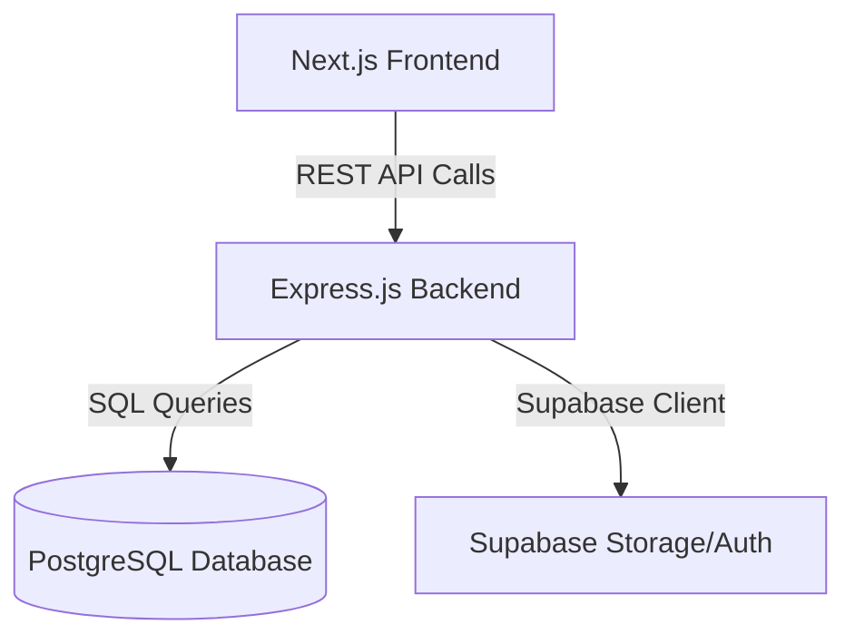

# QuickServe (FYP-WEB) - System Overview

This document provides a comprehensive overview of the **QuickServe** system architecture, technologies, and directory structure. It explains how the frontend, backend, and database interact to form the complete application.

---

## 🏗 System Architecture

The application follows a traditional client-server architecture with a clear separation of concerns between the frontend (UI/UX) and the backend (Business Logic & Data Access).



### 1. The Frontend (Client)
- **Framework:** [Next.js](https://nextjs.org/) (Version 16+ using the App Router)
- **Styling:** [Tailwind CSS](https://tailwindcss.com/)
- **State & Data Fetching:** React Hooks, Axios
- **Data Visualization:** Chart.js & React-Chartjs-2
- **Icons:** Lucide React

The frontend is broken down into specific role-based access areas in the `app` directory.

### 2. The Backend (Server)
- **Framework:** [Node.js](https://nodejs.org/" class="external-link" target="_blank") with [Express.js](https://expressjs.com/)
- **Authentication:** JWT (JSON Web Tokens) and bcrypt for password hashing
- **File Uploads:** Multer
- **Database Driver:** `pg` (PostgreSQL)

The backend provides a RESTful API that the frontend consumes. It handles authentication, authorization, processing business rules, and interacting with the database.

### 3. The Database & Cloud Services
- **Main Database:** PostgreSQL (Hosted on Supabase)
- **File Storage:** Supabase Storage (for images and documents)
- **Connections:** The backend connects to the database using connection pooling (`pg`) for queries and the `@supabase/supabase-js` SDK for specific Supabase features.

---

## 📂 Directory Structure Explained

### Frontend (`/frontend`)
The Next.js frontend uses the futuristic app router (`/app`) structure:

- **`/app/(dashboard)`**: Contains the protected dashboards for different roles.
  - **`/admin`**: User management, system metrics, complaint handling, and global categories.
  - **`/customer`**: Service browsing, booking history, reviews, and customer profile.
  - **`/provider`**: Service management, availability scheduling, booking tracking, and earnings.
- **`/app/(public)`**: Unauthenticated pages like the landing page, login, and registration.
- **`/app/chat`**: Real-time communication interface for users and providers.
- **`globals.css`**: Global Tailwind utility classes and base styles.

### Backend (`/Backend`)
The Express API logic is compartmentalized inside the `/src` folder:

- **`/controllers`**: The brain of the API. Contains the logic for fulfilling requests (e.g., `bookingController.js` handles creating/canceling bookings).
- **`/routes`**: Defines the endpoints (URLs) and maps them to the appropriate controller functions.
- **`/middlewares`**: 
  - `authMiddleware.js`: Verifies JWT tokens to ensure the user is logged in.
  - `roleMiddleware.js`: Role-based access control (RBAC), ensuring only authorized roles (e.g., admin) can access certain routes.
- **`/config` & `/utils`**: Helper functions, configurations, and Supabase client initializers.
- **`server.js`**: The main entry point where Express is initialized, middlewares are attached, and API routes are registered.

---

## 💡 How Key Features Work

### 1. Authentication & Authorization Flow
1. A user logs in via the Next.js frontend.
2. The frontend sends credentials (`axios.post`) to the backend `/api/auth/login`.
3. The backend validates the password using `bcrypt`, generates a JWT, and sends it back.
4. The frontend stores the token (typically in local storage or cookies) and includes it in the `Authorization` header for all future requests.
5. Backend routes are protected by the `protect` middleware, and role-specific routes use `authorizeRoles('admin', etc.)`.

### 2. Booking a Service
1. **Customer** selects a service and time slot via the frontend client.
2. The UI sends a POST request to `/api/bookings`.
3. The `bookingController` validates the provider's availability, calculates the price, and inserts a pending booking into the database.
4. Notifications are generated and sent to the **Provider**.

### 3. Real-time Features & Chat
- Messages and notifications operate via the backend `/api/messages` and `/api/notifications` endpoints. These tables likely have real-time listeners (via Supabase or polling) on the frontend to alert customers and providers of updates instantly without needing to refresh the page.

### 4. Admin Management
- The admin dashboard retrieves broad aggregate data using specialized admin endpoints (`/api/admin`). It relies on `Chart.js` on the frontend to visualize database stats (like revenue, signups, and booking frequency) processed by the `adminController`.

---

## 🚀 Getting Started Locally

To run the application locally:

**Backend:**
```bash
cd Backend
npm install
npm run dev # Starts the server on http://localhost:5000 using nodemon
```

**Frontend:**
```bash
cd frontend
npm install
npm run dev # Starts the Next.js frontend on http://localhost:3000
```
